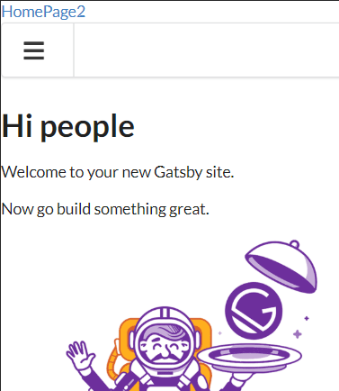
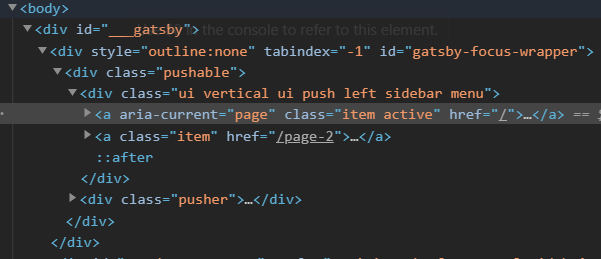

# Bug in Gatsby+Semantic UI?

The following repo based on gatsby-starter-default demonstrates unexpected
behavior.

When using `gatsby develop` is used the web page looks like this on desktop:

And this on a mobile, i.e. narrower screen:

However when using `gatsby build` to generate a static site, the served site
produces the following correct result for desktop:

However, for mobile the output is incorrect:

If the browser windows is made bigger so that it triggers the desktop view and
then back to the mobile, it will render correctly.

## DOM

The reason is that the DOM is not properly set on the inital load. Its missing
the Semantic UI class items.

But when it's reloaded by resize, it sets the DOM correctly.

## Code

These DOM entries comes from component `MobileContainer` class in
[src/components/layout.js](src/components/layout.js). I believe the
`Responsive` (L56) and `Sidebar` (L61) are the two
components/divs that are missing class entries.
